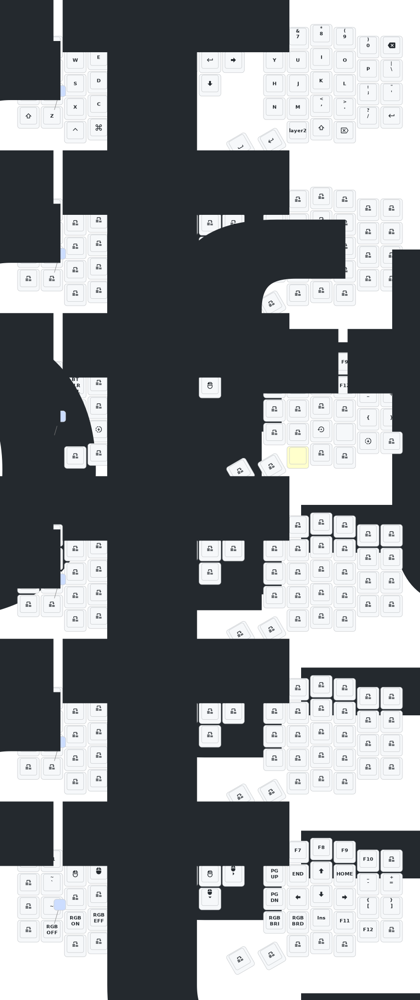

# (Forked from orig)

for sofle keyboard

Note: This is a fork for this particular Sofle keyboard

* NOTE: I can use git actions to build the firmware, AND to draw the new layout (will be shown below)

* NOTE: draw.yaml workflow seems to not always take the most recent pushed code from the branch I specified.

I will probably create branches to try out different layouts.
specifically, I will try to reproduce a miryoku layout.
I might want to use miryoku's fork to build a ready made layout. and then copy it here (and update it to reflect the different
hardware such as the joystick)

To compile - go to Actions > (choose main branch) >  Build ZMK Firmware
(And wait some 10 minutes till icon turns green)

Notes for getting miryoku to be generated into a zmk .keymap file:

vi miryoku/custom_config.h
pipx install pcpp
cd config/
pcpp --passthu-unfound-includes sofle.keymap  > out.keymap

# Sofle

- [Chinese](README.md)
- [English](README_EN.md)

## Update List

- 2024/12/21
  1. Added support for zmk-studio (just refresh the left hand to use).
- 2024/10/24
  1. Modified power supply mode to reduce power consumption.
  2. Fixed the automatic shut-off feature for RGB power supply.
- 2025/8/22
  1. update the soft off.When you press the keys Q, S and Z simultaneously and hold them for 2 seconds, the keyboard will enter a deep sleep state and cannot be awakened by pressing the keys. This function can be used when carrying it outside. The activation method is to press the reset switch once.
  2. This month, I also updated the ultra-thin versions of the corne and sofle cases. The frame and base plate have been thickened, and the opening of the reset switch has been adjusted, so that the reset switch can be easily pressed. At present, we are still conceptualizing how to design the shell with an inclined bracket.If you have carefully examined a PCB, you will notice that there are reserved interfaces for expansion IO. I wonder if anyone has been able to utilize them,I will try it！
  3. The GIF animations on the right-hand keyboard screen have been removed, which will significantly reduce the power consumption of the right-hand keyboard.

> If your  sofle was updated before 2025/8/22, please update to the latest firmware.
>

## Contact Me

For 3D printed model files or any issues and malfunctions with the keyboard, please contact [380465425@qq.com](mailto:380465425@qq.com)

## Sofle Keymap

svg:

